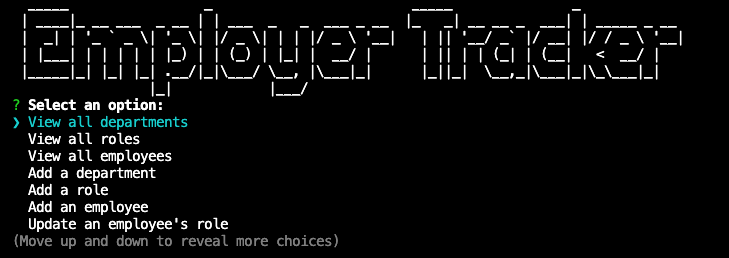
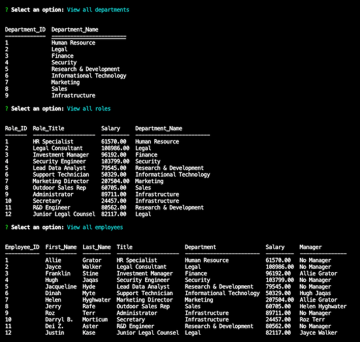

# workforce-navigator

Workforce Navigator is a command-line application built with Node.js, Inquirer, and MySQL, designed to help efficiently manage an organization's workforce. From viewing and updating an employee's information to calculating a department's salary, Workforce Navigator simplifies these tasks, providing a user-friendly interface right into the local terminal.

## Description

With Workforce Navigator, you can:

- View and update employee details, including names, roles, and managers.
- Assign roles to employees and adjust them as the organization evolves.
- Calculate total departmental salaries at a glance.
- Seamlessly interact with the MySQL database, making it easy to keep the workforce information up-to-date.

Take control of a organization's workforce management with Workforce Navigator.

Start streamlining the HR and employee management processes today!

## Table of Contents

- [Installation](#installation)
- [Usage](#usage)
- [Testing](#testing)
- [Screenshots](#screenshots)
- [Link](#link)
- [Contact Me](#contact-me)

## Installation

To run this application, please install the following software and Node.js packages:

- **Node.js:** Make sure to have Node.js installed. Download it from [nodejs.org](nodejs.org).

- **MySQL Database:** Access to a MySQL database server is required. Download and install MySQL from [mysql](https://dev.mysql.com/downloads/mysql/) or from [homebrew](https://formulae.brew.sh/formula/mysql).

- **Node.js Packages:** Use 'npm' (Node Package Manager) to install the required Node.js packages.

  - Open the terminal and navigate to the project directory.
  - Execute the following command to install the essential packages: npm install
  - This command will install the following packages and their dependencies:

    - console.table
    - Inquirer (version 8.2.4)
    - Figlet
    - mysql2 (version 3.6.1)
    - util (Built-in Node.js module)

**Make sure to verify that the project's configuration files have the required MySQL database connection settings and make any necessary adjustments.**

## Usage

1. **Clone the Repository:**

   - Clone this repository to the local machine using Git:
     ```sh
      git clone git@github.com:Clkwong3/biz-wizard-cli.git
     ```

2. **Install Dependencies:**

   - Navigate to the project directory in the terminal.

   - Run the following command to install the required Node.js packages:
     ```sh
     npm install
     ```

3. **Configure Database:**

   - Check if the MySQL database server is running.
   - Configure the MySQL database connection settings in the project's configuration files if needed.

4. **Create the Database Schema:**

   - Use the provided SQL schema file to create the necessary database schema (Replace the username with local MySQL username and the schema_name with the desired schema name):
     ```sh
     mysql -u <username> -p <schema_name> < schema.sql
     ```

5. **(Optional) Seed the Database:**

   - To populate the database with sample data, use the provided SQL seed file:
     ```sh
     mysql -u <username> -p <schema_name> < seeds.sql
     ```

6. **Run the Application:**

   - Start the application by running:
     ```sh
     node index.js
     ```

7. **Interact with the Application:**

   - Follow the prompts in the command line interface to interact with the application.

8. **Exit the Application:**
   - To exit the application, follow the on-screen instructions or use the appropriate command (e.g., Ctrl+C).

## Testing

To test the SQL queries or database interactions, use the provided `query.sql` file. This file contains sample SQL queries and data manipulation statements that can execute against the configured database.

Follow these steps to perform database testing:

1. Ensure that the MySQL database connection is set up and configured as described in the Installation section.

2. Open a terminal window and navigate to the project directory.

3. Run the SQL queries in the `query.sql` file against your database. Use a MySQL client or the command line to execute these queries.

   For example:

   ```sh
   mysql -u <username> -p <schema_name> < query.sql
   ```

4. Review the output and results to ensure that the database interactions are functioning as expected.

Feel free to adapt and expand on the provided queries for different testing needs.

## Screenshots

figlet-header:



npm console.table:



## Link

Here is the Demo Video for this project:

- Walkthrough Video: [screencastify](https://example.com)

## Contact Me

If you encounter any issues, please report them on the project's [GitHub repository](https://github.com/Clkwong3/workforce-navigator).

You can also connect with me on [GitHub](https://github.com/Clkwong3).
